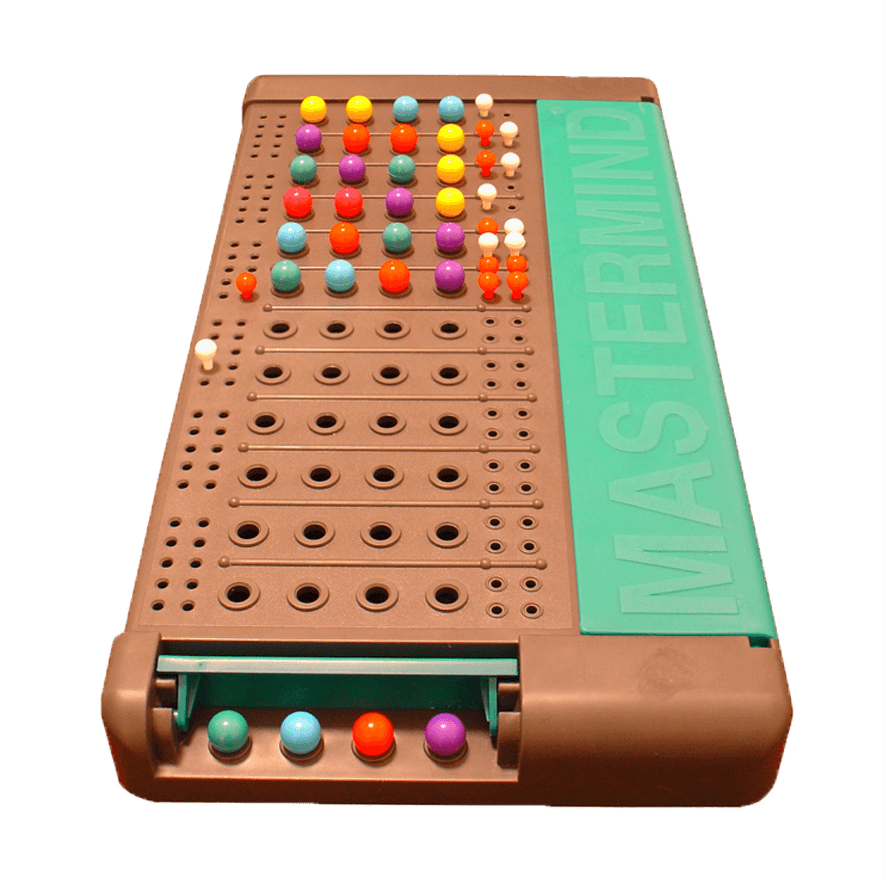
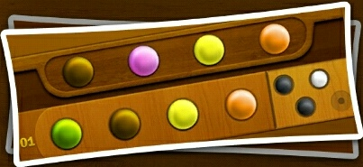
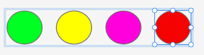
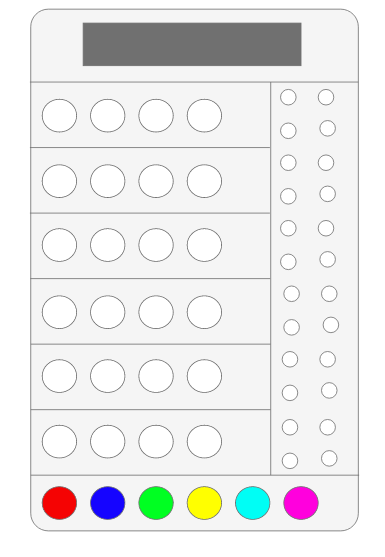
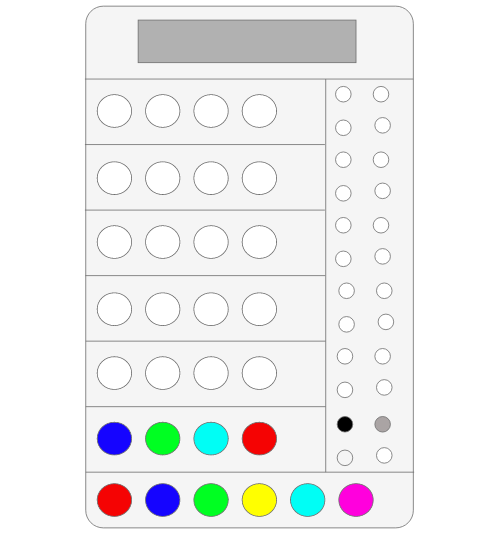
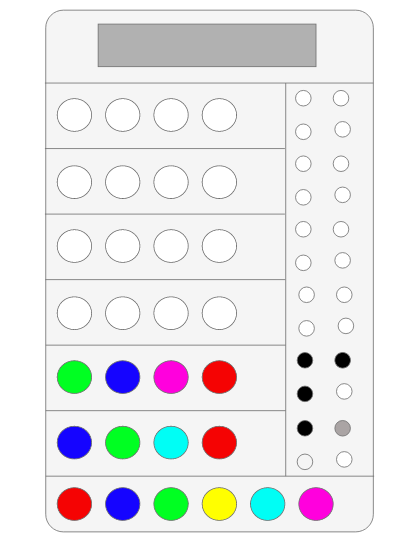
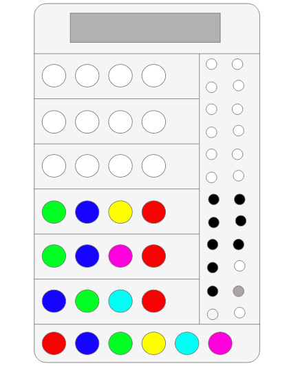

 # Master Mind Game in Console Application.
##  Game Rules And How To Play.
  
### THE ACTUAL BOARD IS :

  ### How To Play ?
*  You are a code breaker,and your goal is to guess the secret code.
*  The Code is a sequence of  colored pegs,and in each round after you make a guess,  
*  You will get hints which will helps to improve your guess. repeat this until you figure out the secret code.

#### The Hints are either WHITE or **BLACK**
  
  WHITE => One of Your guess pegs. Has the _Correct Color_. But in the **Wrong Position**.

  **BLACK** => One of Your guess pegs. Has the _Correct Color_. ANd is in the **Correct Position**.

*  Don't be fooled by the WHITE and **BLACK** hint pegs sequence: They are not in order with your guessed pegs.

* Using logic and comparing clues from different rounds,you can figure out which pegs are in the correct position and which colors are correct ,but not in the right positions.

### Now let's see an example:

* The 3rd and 4th pegs are a perfect match,that's why the hints shows 2 **BLACK** pegs. The 2nd peg has the right color, but is in the wrong position,so you get a white hint for it.The 1st peg is completely wrong,so you get no hint for that.

 
 # State Machine :

* The very first state is in empty state.
* AI randomly choose some colors and hide it.
* AI choose the four colors peg from the pegs and hide it from the user.
* The first step for the user is to break the code and fill the board with colors.
* Then AI gives some clue for the Player with white or black color.
* If the code is broken user win.
* If the code is non breakable in some steps the game is over.

## let's play a sample game : 
* my secret code is :

* lets Try to break the code step by step.

### The first in empty

### The First attempt
* The first try is always a guess because you don't know the code. so we try with our guess.
After the first attempt, you get the clue.
* I found the two colors that one color is in correct position and the another one is correct but in different position.
* So try to use the clues to find out the next colors and fit in the correct position. 

### The Second attempt
* In Second attempt shuffle the pegs and place pegs in the position where i want.
* And i found the three colors is in the correct position and correct color.
* so i need to find the one missing color.

### The Third attempt
* In third attempt, I found the four color code so the clue pegs are turned black.
* I found the code.

### Now it’s your turn
* Now you know how Mastermind works, and how to use problem-solved thinking to solve the code.
* In how many attempts could you solve a code?
And how much codes can you solve?
* Enjoy the Game. 
# DFA Diagram :
